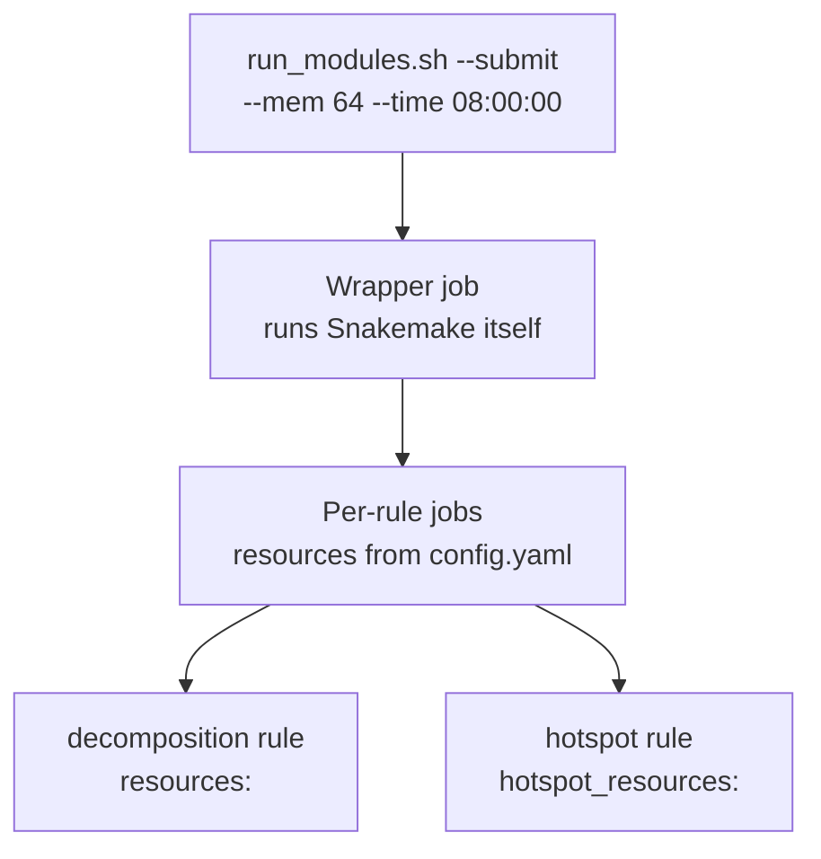

# Configuration

PerturbScape uses two-level configuration. A master `config.yaml` at the
repository root holds everything shared across modules; each module directory has
its own `config.yaml` for method-specific parameters and overrides.

```
perturbscape/
├── config.yaml            master: input, mode, hotspot, resources
├── cpca/config.yaml       module: n_components, max_log_alpha, ...
├── cnmf/config.yaml       module: k_mode, n_iter, ...
└── ...
```

## How merging works

Every `Snakefile` calls `load_merged_config()` at parse time:

1. Load the master config.
2. Load the module config.
3. For each key in the module config: if **both** values are dicts, the module's
   keys are merged into the master's dict; otherwise the module value
   **replaces** the master value outright.

### The nested-dict subtlety

This shallow merge on dicts is what makes partial resource overrides work. Given
a master config of:

```yaml
resources:
  mem_mb: 128000
  partition: "cpu"
  time: "08:00:00"
```

and a module config of:

```yaml
resources:
  threads: 16
```

the effective result keeps all three master keys and adds `threads`. This is
exactly what [`cnmf`](modules/baselines.md#cnmf) relies on.

!!! warning "Non-dict values replace, they do not merge"
    `targets` is a list, not a dict. Setting it in a module config replaces the
    master list entirely rather than extending it. The same applies to every
    scalar.

### What lives where

| Setting | Master | Module |
|---|:--:|:--:|
| `input_h5ad`, `obs_column`, `background_label`, `counts_layer` | <span class="ps-yes">yes</span> | override |
| `mode`, `targets`, `min_cells` | <span class="ps-yes">yes</span> | override |
| `run_hotspot`, `hotspot_*` | <span class="ps-yes">yes</span> | <span class="ps-no">no</span> |
| `output_dir`, `temp_dir` | <span class="ps-yes">yes</span> | override |
| `resources`, `hotspot_resources` | <span class="ps-yes">yes</span> | override |
| `n_components`, `max_log_alpha`, `gamma`, `k_single`, ... | <span class="ps-no">no</span> | <span class="ps-yes">yes</span> |

Every module `config.yaml` ships with the shared keys present but commented out,
as a reminder that they are available to override.

---

## Master config reference

### Input data

`input_h5ad`
:   **string (absolute path)**, default `"/my_awesome_path/my_perfect_data.h5ad"`

    Path to the AnnData file. **The one value you must change.** It is read at
    parse time by every module, so it must be readable from the node running the
    wrapper job.

`obs_column`
:   **string**, default `"gene"` - column in `adata.obs` containing perturbation
    labels.

`background_label`
:   **string**, default `"non-targeting"` - the value within `obs_column`
    identifying control cells. Must match exactly; a `ValueError` is raised at
    parse time if absent.

`counts_layer`
:   **string**, default `"counts"` - layer holding raw counts. Required by
    Hotspot's depth-adjusted negative binomial model and by `cnmf`, both of which
    need unnormalized counts.

`mode`
:   **`"singular"` | `"pooled"`**, default `"singular"`. See
    [Analysis modes](#analysis-modes). Any other value raises `ValueError`.

`targets`
:   **list of strings**, default `[]` - perturbations to analyze. Empty means
    every label except `background_label`. Each named target is validated at
    parse time.

`min_cells`
:   **integer**, default `0` - minimum cells required. Applied to the background
    in both modes, and to each perturbation in `singular` mode.

    !!! danger "Raise this before a full run"
        The default of `0` submits a job for every perturbation regardless of
        size. Contrastive modules hard-fail below 25 cells in either group, so
        anything under 25 is guaranteed wasted cluster time. Start at 50.

### Hotspot

`run_hotspot`
:   **boolean**, default `true`. When `false`, Hotspot outputs drop out of the
    workflow targets. No effect on [`de-dgca`](modules/de-dgca.md), which never
    runs it.

`hotspot_n_neighbors`
:   **integer**, default `20` - neighbours in the KNN graph. Smaller values
    detect finer local programs; larger values detect broader ones.

`hotspot_fdr_threshold`
:   **float**, default `0.05` - used twice: to select significant genes for local
    correlation, and again during module creation.

`hotspot_min_gene_threshold`
:   **integer**, default `30` - minimum genes for a cluster to be retained.
    Smaller clusters are labelled `-1`.

### Output

`output_dir`
:   **string**, default `"results"`. Results go to
    `<output_dir>/<sanitized_target>/`. Relative paths resolve against the module
    directory, so each module writes its own `results/` tree.

`temp_dir`
:   **`"auto"` or absolute path**, default `"auto"` - scratch space. `"auto"`
    uses `$TMPDIR` or `/tmp`.

    !!! tip "Set this explicitly on most clusters"
        `cnmf` and `de-dgca` write substantial intermediates. Node-local `/tmp`
        is often small, and jobs die with confusing disk errors when it fills.

### Resources

`resources`
:   **mapping**, default `mem_mb: 128000`, `partition: "cpu"`, `time: "08:00:00"` -
    SLURM resources for each module's main rule.

`hotspot_resources`
:   **mapping**, default `mem_mb: 64000`, `threads: 8`, `partition: "cpu"`,
    `time: "04:00:00"`. `threads` is passed to Hotspot as its `jobs` parameter.

### Complete default file

```yaml
# INPUT DATA
input_h5ad: "/my_awesome_path/my_perfect_data.h5ad"

# PERTURBATION SETTINGS
obs_column: "gene"
background_label: "non-targeting"
counts_layer: "counts"
mode: "singular"
targets: []
min_cells: 0

# HOTSPOT SETTINGS
run_hotspot: true
hotspot_n_neighbors: 20
hotspot_fdr_threshold: 0.05
hotspot_min_gene_threshold: 30

# OUTPUT
output_dir: "results"
temp_dir: "auto"

# RESOURCES
resources:
  mem_mb: 128000
  partition: "cpu"
  time: "08:00:00"

hotspot_resources:
  mem_mb: 64000
  threads: 8
  partition: "cpu"
  time: "04:00:00"
```

---

## Analysis modes

`mode` determines the unit of analysis, and with it the number of jobs, the
memory profile, and what the results mean.

=== "singular"

    ```yaml
    mode: "singular"
    ```

    One job per perturbation, each contrasted against the background
    independently. Results land in `results/<perturbation>/`.

    **Asks:** what does *this specific* perturbation do?

    This is the mode that produces per-perturbation gene programs, and therefore
    the mode required for perturbation-level
    [disease enrichment](methods/disease-enrichment.md).

    ```mermaid
    flowchart LR
        A[".h5ad"] --> B["TP53 vs background"] --> B1["results/TP53/"]
        A --> C["MYC vs background"] --> C1["results/MYC/"]
        A --> D["KRAS vs background"] --> D1["results/KRAS/"]
    ```

=== "pooled"

    ```yaml
    mode: "pooled"
    ```

    A single job. All targeted perturbations are combined into one group and
    contrasted against the background. Results land in `results/pooled/`.

    **Asks:** what is the shared signature of perturbation in this system?

    Also the practical way to get a first result from a large screen: one job,
    one set of outputs, minutes instead of a queue full of jobs.

    ```mermaid
    flowchart LR
        A[".h5ad"] --> B["TP53 + MYC + KRAS<br/>combined"] --> D["single contrast"]
        A --> C["background"] --> D
        D --> E["results/pooled/"]
    ```

### Choosing

| | `singular` | `pooled` |
|---|---|---|
| Jobs per module | One per surviving target | Exactly one |
| Output directory | `results/<target>/` | `results/pooled/` |
| Power per contrast | Limited by the smallest group | High |
| Perturbation-specific effects | <span class="ps-yes">detected</span> | <span class="ps-no">not detected</span> |
| Shared perturbation response | Indirectly | <span class="ps-yes">detected</span> |
| Feasible on a genome-scale screen | Needs a sensible `min_cells` | Always |

!!! tip "They answer different questions - run both"
    Pooled mode is not a cheap approximation of singular mode. A program that
    appears in pooled but in no individual perturbation is a genuinely shared
    response; a program strong in one perturbation may vanish when pooled.

    In the published data, pooled runs appear under the perturbation name
    `All`. The [Data Portal](../data/index.md) hides them by default.

### Interaction with `targets` and `min_cells`

`targets` filters before the mode is applied. In `singular` mode a list of three
targets means three jobs; in `pooled` mode it means one job pooling exactly those
three and ignoring every other perturbation in the file.

The `min_cells` threshold applies differently per mode:

| Mode | Applied to |
|---|---|
| Both | The background group - failure here is fatal |
| `singular` | Each perturbation individually; those below are dropped with a printed list |
| `pooled` | The **combined total** across all targets, not each one |

So in pooled mode `min_cells` will almost never exclude anything, because the sum
across perturbations is large. Small perturbations are silently absorbed.

!!! warning "Two different thresholds are in play"
    `min_cells` filters at the Snakemake level. Contrastive modules
    *additionally* raise `Not enough cells in target or background! Make sure
    both > 25!` inside the fit. Setting `min_cells` below 25 in singular mode
    means submitting jobs that cannot succeed.

---

## Resources and SLURM

PerturbScape requests resources at two levels, and they are easy to confuse.



**Wrapper job resources** come from `run_modules.sh` flags. This job does almost
no computation - it runs the Snakemake process, which reads the `.h5ad` and then
submits and supervises the real jobs.

**Analysis job resources** come from `resources:` and `hotspot_resources:` in the
config. These are the jobs that do the work.

!!! warning "`--mem` on run_modules.sh does not size your analysis jobs"
    Raising `--mem` gives more memory to the supervisor. If a decomposition job
    is being OOM-killed, the fix is `resources.mem_mb` in the module's
    `config.yaml`. The one thing the wrapper does need memory for is reading your
    `.h5ad` at parse time - a very large file may require raising `--mem` even
    though no analysis has started.

### Wrapper defaults

| Flag | `--build-conda` | `--submit` |
|---|---|---|
| `--mem` | 8 GB | 64 GB |
| `--time` | `01:00:00` | `08:00:00` |
| `--partition` | `cpu` | `cpu` |

Set the wrapper's wall time longer than the total time your jobs need. If the
wrapper is killed, Snakemake dies with it and the pipeline stalls even though
individual jobs may still be running.

### Per-module guidance

| Module | Suggested `mem_mb` | Notes |
|---|---:|---|
| `pca` | 32,000 | Lightest module; good for a first test |
| `cpca` | 128,000 | 40 alpha values, each an eigendecomposition |
| `contrapc` | 128,000 | Same, plus a background eigendecomposition |
| `kcpca` | 256,000 | Fourier feature expansion dominates memory |
| `kcontrapc` | 256,000 | As above, plus the background eigendecomposition |
| `cnmf` | 128,000 | Set `threads`; scales with `n_iter` times K |
| `contrastivevi` | 128,000 | Neural model; benefits from a GPU |
| `de-dgca` | 128,000 | Permutation-based; scales with `dgca_n_perm` |

Starting points, not measurements. Actual usage is driven by the number of cells
and genes surviving filtering.

### Overriding per module

```yaml
# kcpca/config.yaml
resources:
  mem_mb: 256000
  partition: "bigmem"
  time: "12:00:00"

hotspot_resources:
  mem_mb: 128000
  threads: 16
  time: "06:00:00"
```

Because [dict merging is shallow](#the-nested-dict-subtlety), specify only the
keys you want to change.

### GPU partitions

[`contrastivevi`](modules/contrastivevi.md) is the one module that meaningfully
benefits from a GPU:

```yaml
# contrastivevi/config.yaml
resources:
  partition: "gpu"
  mem_mb: 64000
  time: "12:00:00"
```

Your cluster may also need a GRES specification in the module's `profile/`.
Check the existing profile rather than assuming `partition` alone is enough.

### Estimating total load

In `singular` mode, jobs per module equals the number of perturbations passing
`min_cells`. A screen with 500 surviving perturbations produces roughly:

```
500 perturbations × 7 modules × 2 rules  ≈  7,000 jobs
500 perturbations × 1 module  × 2 rules  ≈  1,000 jobs   (de-dgca)
                                            ─────────────
                                              ~8,000 jobs
```

Submit one module first, confirm per-job runtime and memory from `sacct`, then
scale out.

### Retry behaviour

The pipeline retries automatically at two levels: SLURM submission retries for
transient cluster issues, and Snakemake rule retries for transient job failures.
Persistent failures - OOM, bad config, too few cells - are not fixed by retries
and will exhaust them.
