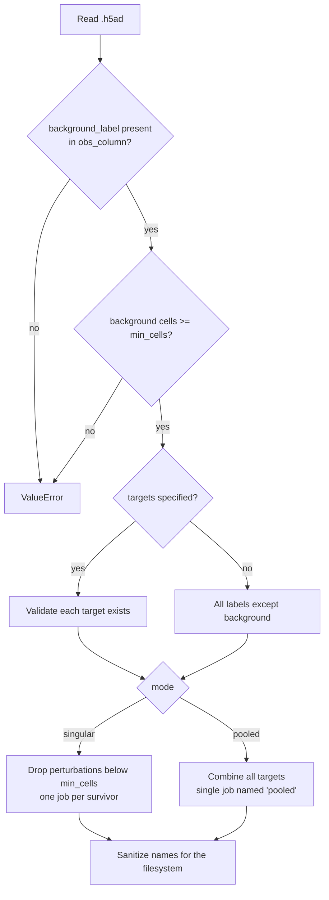

# Getting Started

Three steps: install Snakemake and the cluster shim, verify your input data,
then build the module environments and run.

## Installation

### Clone the repository

```bash
git clone https://github.com/Deylab999MSKCC/perturbscape.git
cd perturbscape
```

### Create the Snakemake environment

Snakemake 8 or newer is required - the pipeline relies on the executor plugin
architecture introduced in that release.

```bash
conda create -n snakemake python=3.10
conda activate snakemake

pip install snakemake
pip install snakemake-executor-plugin-slurm
pip install snakemake-executor-plugin-cluster-generic
pip install scanpy
```

!!! note "Why scanpy here as well as in the modules"
    Each `Snakefile` reads the input `.h5ad` at parse time to enumerate
    perturbations and their cell counts. That happens in the Snakemake
    environment, before any job is submitted, so `scanpy` must be importable
    there - not only inside the module environments.

### Configure the cluster shim

`run_modules.sh` needs to know how to activate conda on a compute node:

```bash
cp snakemake_env.sh.template .snakemake_env.sh
nano .snakemake_env.sh
```

```bash
# Script that initializes conda on your cluster
CONDA_INIT_SCRIPT="$HOME/.bashrc"

# Conda environment containing snakemake
SNAKEMAKE_ENV="snakemake"

# Optional: anything that must run before conda, e.g. module loads
PRE_CONDA_COMMANDS=""
```

`PRE_CONDA_COMMANDS` is the escape hatch for clusters using environment modules,
for example `PRE_CONDA_COMMANDS="module load miniconda3"`.

### Build the module environments

Each module declares its own `environment.yaml`. Build them before submitting
any analysis, otherwise the first job of every module pays the build cost and
concurrent builds can collide.

=== "All modules"

    ```bash
    ./run_modules.sh --build-conda --all
    ```

=== "Specific modules"

    ```bash
    ./run_modules.sh --build-conda --modules cnmf,cpca
    ```

=== "Interactively"

    ```bash
    ./run_modules.sh --build-conda --all --interactive
    ```

=== "With more memory"

    ```bash
    ./run_modules.sh --build-conda --all --mem 16 --time 01:00:00
    ```

Builds default to 8 GB and one hour. `cnmf` and `contrastivevi` have the
heaviest dependency trees; if a build is killed, retry with `--mem 16`.

---

## Input data

PerturbScape takes a single AnnData `.h5ad` containing both perturbed cells and
a set of control or wild-type cells.

| Requirement | Config key | Description |
|---|---|---|
| Perturbation labels | `obs_column` | Column in `adata.obs` naming the perturbation applied to each cell |
| Control cells | `background_label` | Value within `obs_column` marking control cells |
| Raw counts | `counts_layer` | Layer in `adata.layers` holding unnormalized counts |

The defaults assume a CRISPRi-style experiment:

```yaml
obs_column: "gene"
background_label: "non-targeting"
counts_layer: "counts"
```

### Verify before configuring anything

```python
import scanpy as sc

adata = sc.read_h5ad("data.h5ad")

# 1. Perturbation labels exist and are populated
print(adata.obs["gene"].value_counts())

# 2. Background cells present under the exact label you will configure
print("Background cells:", (adata.obs["gene"] == "non-targeting").sum())

# 3. Raw counts layer exists
print("Counts layer:", "counts" in adata.layers)

# 4. How many perturbations survive at each min_cells threshold
counts = adata.obs["gene"].value_counts().drop("non-targeting")
for m in (0, 25, 50, 100):
    print(f"min_cells={m:>4} -> {(counts >= m).sum()} perturbations")
```

That last block matters more than it looks. In `singular` mode the pipeline
creates one job per surviving perturbation, so `min_cells` is the single biggest
lever on how many jobs you submit.

### How targets are resolved

Each `Snakefile` performs this at parse time, before any job is submitted:



Perturbations dropped for having too few cells are printed with their counts, so
check the wrapper log to see exactly which were excluded.

### Name sanitization

Perturbation labels become directory names:

| Character | Replaced with |
|---|---|
| space | `_` |
| `/` | `_` |
| `:` | `_` |

A perturbation named `TP53/MDM2` writes to `results/TP53_MDM2/`.

!!! warning "Sanitization can collide"
    `TP53/MDM2` and `TP53:MDM2` both sanitize to `TP53_MDM2` and would overwrite
    each other. Check for collisions if your labels contain these characters.

---

## Quickstart

```bash
# 1. Configure the cluster environment shim
cp snakemake_env.sh.template .snakemake_env.sh
nano .snakemake_env.sh

# 2. Configure the analysis
nano config.yaml

# 3. Build conda environments
./run_modules.sh --build-conda --all

# 4. Dry run before spending cluster time
./run_modules.sh --submit --all --dry-run

# 5. Submit
./run_modules.sh --submit --all

# 6. Monitor
squeue -u $USER
tail -f cpca/logs/wrapper/snakemake_*.out

# 7. Inspect
ls results/*/
```

### A minimal config

The only value you must change is `input_h5ad`:

```yaml
input_h5ad: "/path/to/your/data.h5ad"

obs_column: "gene"
background_label: "non-targeting"
counts_layer: "counts"

mode: "singular"
targets: []          # empty = every perturbation
min_cells: 50

run_hotspot: true
hotspot_n_neighbors: 20
hotspot_fdr_threshold: 0.05
hotspot_min_gene_threshold: 30

output_dir: "results"
```

!!! danger "Set `min_cells` before your first full run"
    The shipped default is `min_cells: 0`, which makes every perturbation a job,
    including ones with a handful of cells that will produce noise, fail, or
    both. Contrastive modules hard-fail below **25 cells** in either group, so
    anything under 25 is guaranteed wasted cluster time. Start at 50.

### Start small

Validate the pipeline end to end on a couple of perturbations and one cheap
module before launching everything:

```yaml
targets:
  - "GENE1"
  - "GENE2"
```

```bash
./run_modules.sh --submit --modules pca
```

`pca` is the fastest module and exercises the same job hierarchy, Hotspot step,
and output layout as everything else. Once `results/GENE1/` looks right, widen
to the full target list and the remaining modules.

### What success looks like

```
results/
├── GENE1/
│   ├── pca_projection.csv
│   ├── pca_variance_ratio.csv
│   ├── pca_loadings.csv
│   ├── pca_metadata.txt
│   ├── hotspot_pca_results.csv
│   ├── hotspot_pca_local_correlations.csv
│   ├── hotspot_pca_modules.csv
│   ├── hotspot_pca_module_scores.csv
│   └── hotspot_pca_metadata.txt
└── GENE2/
    └── ...
```

See [Outputs](outputs.md) for what each file contains.

### Common startup errors

All of these are raised at parse time, so `--dry-run` catches them:

| Error | Cause | Fix |
|---|---|---|
| `Background label 'X' not found in column 'Y'` | Label does not match any value | Print `adata.obs[Y].unique()` and copy the exact string |
| `Background 'X' has N cells, but min_cells=M required` | Too few control cells | Lower `min_cells` |
| `Target 'X' not found in column 'Y'` | Typo in `targets:` | Fix or remove the entry |
| `No perturbations have >= N cells` | `min_cells` above every count | Lower `min_cells` |
| `Unknown mode: X` | `mode` is not `singular` or `pooled` | Use one of the two |
| `Environment config file '.snakemake_env.sh' not found!` | Shim not created | `cp snakemake_env.sh.template .snakemake_env.sh` |

## Next

- [Configuration](configuration.md) - every key, and how overrides work
- [Running the Pipeline](running.md) - the full command reference
- [Modules](modules/index.md) - choosing between the eight methods
