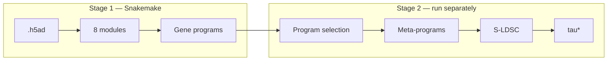

# Documentation

PerturbScape has two stages that run separately.

**Stage 1 - program discovery** is a Snakemake workflow of eight modules,
built for a SLURM cluster. It takes a Perturb-seq `.h5ad` and produces gene
programs for every perturbation.

**Stage 2 - disease enrichment** runs outside Snakemake. It takes those
programs plus GWAS resources and produces a standardized heritability effect
size, tau\*, for every perturbation-trait pair.

## Start here

01
### [Getting Started](getting-started.md)
Install Snakemake and the cluster shim, check your `.h5ad` has what the pipeline
needs, and run a first module end to end.

02
### [Configuration](configuration.md)
The master config, how module configs override it, analysis modes, and how to
size SLURM resources.

03
### [Running the Pipeline](running.md)
Every `run_modules.sh` action and flag, where the logs are, and what to do when
a job fails.

04
### [Outputs](outputs.md)
Where results land and what every file produced by every module contains.

## Understand the methods

### [Methods overview](methods/index.md)
Why contrastive analysis, and how the three layers of the pipeline fit together.

### [Contrastive Embeddings](methods/embeddings.md)
The subtractive and ratio objectives, automatic selection of the contrast
strength, and the kernel variants.

### [Gene Programs and Hotspot](methods/gene-programs.md)
Turning an embedding into interpretable gene modules, and why the graph is built
on the contrastive space.

### [Disease Enrichment](methods/disease-enrichment.md)
Program selection, meta-program construction, variant annotation, S-LDSC, and
tau\* - with the code for each step.

## Module reference

The eight modules, grouped by what they share:

| Group | Modules | Contrastive | Hotspot |
|---|---|:--:|:--:|
| [Linear contrastive](modules/linear-contrastive.md) | `cpca`, `contrapc` | yes | yes |
| [Kernel contrastive](modules/kernel-contrastive.md) | `kcpca`, `kcontrapc` | yes | yes |
| [Non-contrastive baselines](modules/baselines.md) | `pca`, `cnmf` | no | yes |
| [ContrastiveVI](modules/contrastivevi.md) | `contrastivevi` | yes | yes |
| [DE and DGCA](modules/de-dgca.md) | `de-dgca` | yes | no |

[Hotspot](modules/hotspot.md) is not a module of its own - it runs as a second
rule inside each of the seven modules that produce an embedding.

## Requirements

| Requirement | Notes |
|---|---|
| HPC cluster with SLURM | `run_modules.sh` wraps `sbatch`; each module ships a SLURM profile |
| Conda or Miniconda | Every module builds its own isolated environment |
| Snakemake 8+ | Earlier versions lack the executor-plugin architecture |
| A Perturb-seq `.h5ad` | Must contain control cells - see [Getting Started](getting-started.md#input-data) |

Stage 2 additionally needs MAGMA gene-level results, GWAS summary statistics, an
LD reference panel, and variant-to-gene maps. See
[Disease Enrichment](methods/disease-enrichment.md#what-you-need).

!!! warning "Not a laptop workload"
    Default requests are 128 GB for the main jobs and 64 GB for Hotspot, rising
    to 256 GB for the kernel modules. Running locally is realistic only for very
    small test data.
