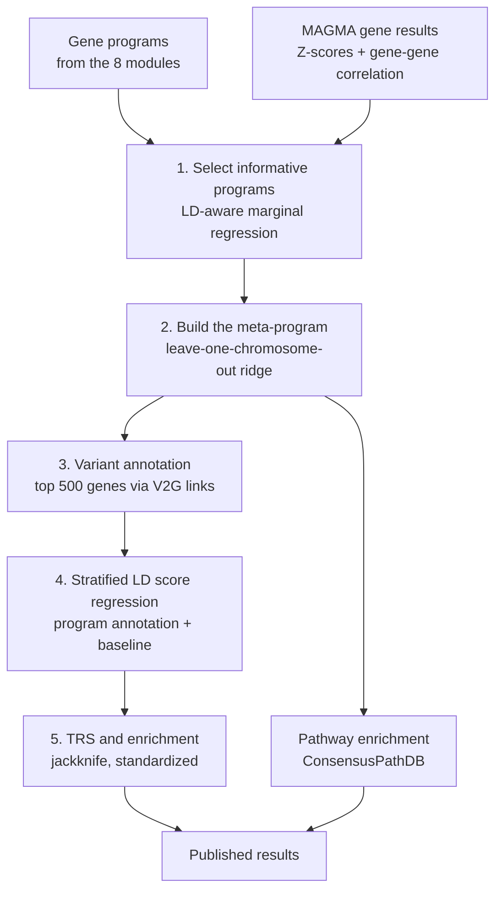

# Disease Enrichment

Stage 1 produces gene programs. This stage asks which of them carry genetic
signal for a complex trait, and turns that into a single standardized number per
perturbation-trait pair.

It runs **outside Snakemake**. The steps below are executed per trait, and within
a trait per perturbation, on a cluster.



## What you need

None of these are distributed with PerturbScape. They are large, separately
licensed, or both.

| Resource | Used by | Notes |
|---|---|---|
| GWAS summary statistics | Steps 1-2, 4 | Munged to LDSC `.sumstats` format |
| MAGMA gene results | Steps 1-2 | Both `.genes.out` (Z-scores) and `.genes.raw` (gene-gene correlations) |
| `NCBI37.3.ensembl.gene.loc` | Steps 1-2 | Gene nomenclature mapping |
| 1000 Genomes EUR PLINK `.bim` | Step 3 | SNP universe for the annotation |
| Variant-to-gene maps | Step 3 | `1000G_v2g_with_encode_e2g`, ENCODE E2G links stored as `.qs` |
| LDSC baseline model and weights | Step 4 | Standard S-LDSC reference files |
| `Orthologs_Yoshida_Mouse_Human.txt` | Steps 1-2 | Only when programs use MGI symbols |

Two conda environments are used, because LDSC still requires Python 2.7:

=== "meta_program"

    ```yaml
    name: meta_program
    channels:
      - conda-forge
      - bioconda
    dependencies:
      - python=3.9
      - r-base=4.3
      - numpy
      - pandas
      - scipy
      - statsmodels
      - scikit-learn
      - datatable
      - r-dplyr
      - r-qs
      - r-glue
      - r-stringr
      - r-rmeta
      - r-data.table
      - r-r.utils
      - bioconductor-genomicranges
    ```

=== "ldsc"

    ```yaml
    name: ldsc
    channels:
      - bioconda
    dependencies:
      - python=2.7
      - bitarray=0.8
      - nose=1.3
      - pybedtools=0.7
      - pip
      - pip:
        - scipy==0.18
        - pandas==0.20
        - numpy==1.16
    ```

---

## Step 1: Select informative programs

Each program is a vector of gene weights. The question is whether that vector
predicts a trait's gene-level GWAS signal.

Testing this naively is wrong, because MAGMA gene Z-scores are correlated between
neighbouring genes through LD. MAGMA reports that correlation structure in the
`.genes.raw` file, and the selection step uses it to whiten both sides of the
regression before testing.

### Building the whitening transform

Per chromosome, the gene-gene correlation matrix is reconstructed, regularized so
it is positive definite, inverted, and Cholesky-factorized:

```python
def compute_Ls(sigmas, args):
    Ls = []
    min_lambda = 0
    for sigma in sigmas:
        W = np.linalg.eigvalsh(sigma)
        min_lambda = min(min_lambda, min(W))
    Y = pd.read_table(args.gene_results + '.gene_trait' + '.genes.out',
                      sep='\s+').ZSTAT.values
    ridge = abs(min(min_lambda, 0)) + .05 + .9 * max(0, np.var(Y) - 1)
    for sigma in sigmas:
        sigma = sigma + ridge * np.identity(sigma.shape[0])
        L = np.linalg.cholesky(np.linalg.inv(sigma))
        Ls.append(L)
    return scipy.linalg.block_diag(*Ls)
```

The ridge term has three parts: enough to make the smallest eigenvalue positive,
a fixed floor of `0.05`, and an inflation term proportional to how far the
Z-score variance exceeds 1 - which grows with the trait's polygenicity.

### Testing each program

Each program column is then tested marginally against the whitened Z-scores:

```python
def marginal_ols(X, Y):
    model = sm.OLS(Y, X).fit()
    return model.params[0], model.bse[0], model.pvalues[0]

LtY = np.matmul(full_L2.T, gene_scores_zstat)
for i in range(nf):
    LtX = np.matmul(full_L2.T, Xmat.iloc[:, i].astype(float))
    coefs[i], std_ers[i], pvals[i] = marginal_ols(LtX, LtY)
```

Run once per method:

```bash
python select_informative_programs.py \
  --supp_path       ${SUPP}/ \
  --magma_path      ${MAGMA} \
  --trait           ${TRAIT} \
  --program_name    cpca \
  --cnmf_program    ${PROGRAMS}/cnmf.csv \
  --cpca_program    ${PROGRAMS}/cpca.csv \
  --contrapc_program ${PROGRAMS}/contrapc.csv \
  --kcpca_program   ${PROGRAMS}/kcpca.csv \
  --kcontrapc_program ${PROGRAMS}/kcontrapc.csv \
  --pca_program     ${PROGRAMS}/pca.csv \
  --contrastivevi_program ${PROGRAMS}/contrastivevi.csv \
  --de_dgca_program ${PROGRAMS}/de-dgca.csv \
  --gene_identifier_type HGNC \
  --output_dir      ${OUT}
```

**Output** `selected_informative_programs/{trait}/{method}.csv` with columns
`Feature`, `BETA`, `SE`, `P`. Programs with `P < 0.05` proceed to step 2.

!!! note "`contrastivevi` is aligned to the `de-dgca` gene universe"
    ContrastiveVI drops genes during model fitting, so its program matrix is
    reindexed onto the `de-dgca` gene list and missing entries filled with zero.
    Without this the method would contribute a different gene set than the rest.

---

## Step 2: Build the meta-program

Selected programs from all eight methods are combined into one gene ranking per
perturbation, using the PoPS approach: standardize features, regress whitened
gene Z-scores on them with ridge, and predict genes on a held-out chromosome.

### Leave one chromosome out

Training on all chromosomes and then scoring the same genes would let LD and
gene-set overlap leak the answer. Instead each chromosome is scored by a model
that never saw it:

```python
X_train = build_training(LXs, args.chromosome)
C_control = build_training(LCs, args.chromosome)
Y_train = build_training(LYs, args.chromosome)
Y_train = project_out_cov(Y_train, C_control)   # remove covariate effects
Y_train_normalized = Y_train - np.mean(Y_train)

regr = initialize_regressor()
regr.fit(X_train, Y_train_normalized)
betahat = regr.coef_

X_predict = features[features.chr.astype('int') == args.chromosome].values[:, 3:]
Y_predict = np.matmul(X_predict.astype(float), betahat)
```

The regressor is ridge with the penalty chosen by cross-validation, scored by
correlation rather than mean squared error:

```python
def initialize_regressor():
    scorer = make_scorer(corr_score)
    alphas = np.logspace(-2, 10, num=12)
    return RidgeCV(alphas=alphas, scoring=scorer, fit_intercept=False)
```

### Control covariates

Gene-level GWAS signal is confounded by gene size and SNP density - longer genes
accumulate more association simply by being longer. Six covariates are projected
out of the response before fitting:

```python
def build_control_covariates(metadata):
    genesize = metadata.NPARAM.values.astype(float)
    genedensity = metadata.NPARAM.values / metadata.NSNPS.values
    inverse_mac = 1.0 / metadata.MAC.values
    return np.stack((genesize, np.log(genesize),
                     genedensity, np.log(genedensity),
                     inverse_mac, np.log(inverse_mac)), axis=1)
```

Run once per trait, perturbation, and chromosome:

```bash
for CHR in $(seq 1 22); do
  python create_meta_program.py \
    --supp_path  ${SUPP}/ \
    --magma_path ${MAGMA} \
    --trait      ${TRAIT} \
    --perturbation ${PERTURBATION} \
    --cnmf_program ${PROGRAMS}/cnmf.csv \
    --cpca_program ${PROGRAMS}/cpca.csv \
    --contrapc_program ${PROGRAMS}/contrapc.csv \
    --kcpca_program ${PROGRAMS}/kcpca.csv \
    --kcontrapc_program ${PROGRAMS}/kcontrapc.csv \
    --pca_program ${PROGRAMS}/pca.csv \
    --contrastivevi_program ${PROGRAMS}/contrastivevi.csv \
    --de_dgca_program ${PROGRAMS}/de-dgca.csv \
    --gene_identifier_type HGNC \
    --chromosome ${CHR} \
    --output_dir ${OUT}
done
```

`--perturbation` accepts a perturbation name, or `all` to use every
non-pooled program column. Any method can be excluded with its `--drop_*` flag,
which is how ablations over method combinations are run.

**Output** `meta_programs/{trait}/{perturbation}/scores_{chr}` and `coefs_{chr}`.
Concatenating the per-chromosome scores gives `combined_scores`, a genome-wide
gene ranking - the meta-program.

!!! warning "A perturbation with no surviving programs still produces output"
    If no program passed selection, the design matrix is empty and every gene is
    assigned the training mean. The meta-program exists but is uninformative, and
    its downstream TRS will be near zero.

---

## Step 3: Variant annotation

S-LDSC works on SNPs, not genes. The top 500 genes of each meta-program are
converted into a binary SNP annotation using variant-to-gene links.

```r
program_genes[[perturbation]] = temp_df[order(temp_df$Score, decreasing=T)[1:500], "HGNC"]
```

Links come from ENCODE E2G variant-to-gene maps, restricted to tissues relevant
to the dataset:

```r
if(sample_type == "blood"){
    c(grep("T-", all_ve2g_files), grep("T_cell", all_ve2g_files),
      grep("hemato", all_ve2g_files), grep("B_cell", all_ve2g_files),
      grep("_CD", all_ve2g_files), grep("monocyte", all_ve2g_files),
      grep("K562", all_ve2g_files), grep("myeloid", all_ve2g_files),
      grep("lymphoid", all_ve2g_files)) -> v2g_files_to_use
    all_ve2g_files <- all_ve2g_files[v2g_files_to_use]
}else if(sample_type == "brain"){
    all_ve2g_files <- all_ve2g_files[grepl("brain|frontal_cortex|head", all_ve2g_files)]
}else if(sample_type == "liver"){
    all_ve2g_files <- grep("LIV|liv|Hep|hep", all_ve2g_files, value=T)
}else if(sample_type == "endothelial"){
    all_ve2g_files <- grep("coronary|aorta|endothelial", all_ve2g_files, value=T)
}
```

Every SNP linked to any of the 500 genes in any retained tissue is marked `1`;
all other 1000G EUR SNPs are `0`:

```r
annot = all_1000g_eur_plink_bim_files %>%
        select(CHR, BP, SNP, CM) %>%
        mutate(!!sym(program_name) := ifelse(SNP %in% all_program_variants_by_perturb[[perturbation]], 1L, 0L))
```

```bash
Rscript save_annotation.R \
  ${SUPP} ${OUT} ${TRAIT} blood HGNC ${PERTURBATION_1} ${PERTURBATION_2} ...
```

**Output** `tau_star/annotations/{trait}/program_{perturbation}/program_{perturbation}.{chr}.annot.gz`

!!! note "Tissue choice is a real modelling decision"
    `sample_type` determines which V2G maps contribute. A blood-derived program
    scored against endothelial links, or vice versa, will systematically
    under-recover its own variants. Match it to the dataset.

---

## Step 4: Stratified LD score regression

Each program annotation is run through S-LDSC on top of the standard baseline
model, one annotation at a time. This is stock LDSC - compute LD scores for the
annotation, then regress GWAS chi-square statistics on them.

```bash
# LD scores for the program annotation
python ldsc.py \
  --l2 --bfile ${PLINK}/1000G.EUR.hg38.${CHR} \
  --ld-wind-cm 1 \
  --annot ${ANNOT}/program_${PERTURBATION}.${CHR}.annot.gz \
  --out   ${ANNOT}/program_${PERTURBATION}.${CHR} \
  --print-snps ${SUPP}/hm3_snps.txt

# marginal model: program annotation + baseline
python ldsc.py \
  --h2 ${SUMSTATS}/${TRAIT}.sumstats.gz \
  --ref-ld-chr ${ANNOT}/program_${PERTURBATION}.,${BASELINE}/baseline. \
  --w-ld-chr ${WEIGHTS}/weights. \
  --overlap-annot --print-coefficients --print-delete-vals \
  --out ${OUT}/tau_star/sldsc_reg_res/${TRAIT}/program_${PERTURBATION}/program_${PERTURBATION}
```

`--print-delete-vals` is required - the jackknife blocks it writes are what step 5
uses for standard errors.

The program annotation is the first in the `--ref-ld-chr` list, which places it at
index 54 once the baseline annotations follow. That index is passed explicitly as
`tau_index` in step 5.

---

## Step 5: TRS and enrichment

The raw S-LDSC coefficient is not comparable across annotations, because it
depends on annotation size and on the trait's total heritability. The
standardized coefficient — tau\* in the S-LDSC literature, and what this site
publishes as the **Trait Relevance Score (TRS)** — fixes that: the per-SNP
effect of a one standard deviation increase in the annotation, as a fraction of
total heritability.

```r
Mref <- 5961159
h2g <- as.numeric(as.character(log_file[which(log_file$V4 == "h2:"), 5]))
coef1 <- Sd_annot.tmp * Mref / h2g
jackknife_taus <- as.numeric(jackknife_res[, tau_index]) * coef1
mean_jackknife_taus <- mean(jackknife_taus)
se_jackknife_taus <- sqrt(199**2 / 200 * stats::var(jackknife_taus))
```

The standard error uses the 200-block delete-one jackknife from LDSC, and the
p-value is one-sided:

```r
tau_meta_info %>% mutate(pvalue = 1 - pnorm(mean / se))
```

Finally the value is **zeroed unless it is positive and significant**, which is
what gets published as TRS:

```r
all_programs_tau %>%
    mutate(tau = ifelse(mean > 0 & pvalue <= 0.05, mean, 0),
           neglog10p = -log10(pvalue)) -> all_programs_tau
```

```bash
Rscript save_tau_star.R  ${SCRIPTS} ${OUT} ${TRAIT} ${PERTURBATIONS[@]}
Rscript save_enrichment.R ${SCRIPTS} ${OUT} ${TRAIT} ${PERTURBATIONS[@]}
```

**Output** `tau_star/tau_star/{trait}.csv` and `tau_star/enrichment/{trait}.csv`.

!!! danger "TRS = 0 means 'not significant', not 'no effect'"
    Because of the `ifelse` above, a zero in the published `trs` column is a
    thresholding artefact, not an estimate. Always read `trs` together with
    `pvalue`. The [Data Portal](../../data/index.md) treats it accordingly.

    Note also that the p-value is one-sided, testing only for positive
    enrichment. Depletion is not tested.

---

## Pathway annotation

The published tables include the pathways enriched in each meta-program. These
come from **ConsensusPathDB** over-representation analysis of the meta-program
genes, drawing on its Reactome and WikiPathways collections. Each row stores the
top pathways and their `-log10(p)` as parallel semicolon-delimited lists.

```
pathways:            Cell Cycle; DNA Repair; Signaling by Rho GTPases; ...
neglog10p_pathways:  4.140; 4.028; 3.870; ...
```

The [Data Portal](../../data/index.md) parses these into a ranked list when you
open a perturbation-trait pair.

---

## Interpreting the results

| Column | Meaning |
|---|---|
| `trs` | Trait Relevance Score — the standardized S-LDSC coefficient, zeroed when not positive and significant |
| `pvalue` | One-sided p-value from the jackknife standard error |
| `pathways` | Top ConsensusPathDB pathways for the meta-program |
| `neglog10p_pathways` | Their `-log10(p)`, in the same order |

A perturbation-trait pair with a large positive TRS and small p-value means:
the genes that this perturbation's programs point to are, through their linked
variants, enriched for heritability of that trait beyond what the baseline model
already explains.

It does **not** establish that perturbing the gene causes the trait. The
annotation is built from correlational V2G links and a gene ranking derived from
GWAS signal, so the claim is about shared genetic architecture, not causality.

## Reproducing the published tables

Every result in the [Data Portal](../../data/index.md) was produced by running
steps 1-5 per dataset, trait, and perturbation, then collecting
`tau_star/tau_star/{trait}.csv` with the pathway annotation into the two
harmonized tables described in [Schema and Downloads](../../data/schema.md).

The scripts themselves are the published implementations of PoPS and sc-linker
adapted to PerturbScape programs, and are not redistributed here. The steps
above give the exact call signatures, parameters, and thresholds used.
