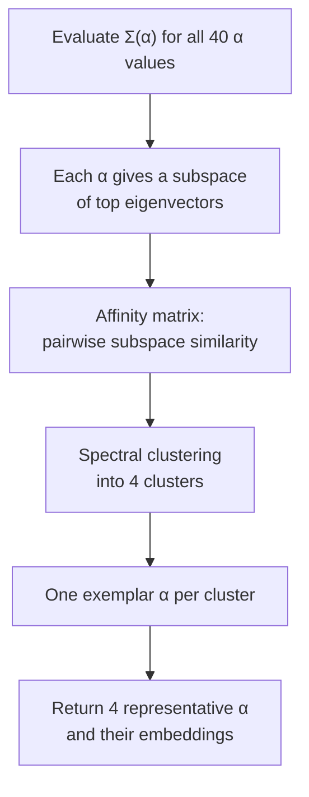

# Contrastive Embeddings

All contrastive modules share the same setup. Let \(X_t\) be the scaled
expression matrix for target (perturbed) cells and \(X_b\) the scaled matrix for
background (control) cells, with covariances

\[
C_t = \frac{X_t^\top X_t}{n_t - 1}, \qquad
C_b = \frac{X_b^\top X_b}{n_b - 1}
\]

Both matrices are standardized independently before the covariances are formed,
and the pipeline skips scaling if a block already has mean \(\approx 0\) and
standard deviation \(\approx 1\).

The methods differ in how they combine \(C_t\) and \(C_b\) into a single matrix
whose eigenvectors become the embedding.

## The two objectives

=== "cPCA — subtractive"

    Used by [`cpca`](../modules/linear-contrastive.md) and its kernel form
    [`kcpca`](../modules/kernel-contrastive.md).

    \[
    \Sigma(\alpha) = C_t - \alpha\, C_b
    \]

    Directions are penalized in proportion to how much variance they carry in
    the background. At \(\alpha = 0\) this is plain PCA on the target cells; as
    \(\alpha\) grows, shared structure is progressively subtracted away.

    The search grid is logarithmic:

    \[
    \alpha \in \{0\} \cup \mathrm{logspace}(-1,\ A,\ 40)
    \]

    where \(A\) is the `max_log_alpha` setting.

=== "ContraNorm — ratio / whitening"

    Used by [`contrapc`](../modules/linear-contrastive.md#contrapc) and its kernel form
    [`kcontrapc`](../modules/kernel-contrastive.md#kcontrapc).

    With the regularized background eigendecomposition
    \(C_b + \gamma I = V \Lambda V^\top\),

    \[
    \Sigma(\alpha) = V \Lambda^{-\alpha} V^\top C_t
    \]

    Instead of subtracting the background, this **whitens by it**. The
    interpolation is bounded:

    - \(\alpha = 0\) → plain PCA on the target
    - \(\alpha = 1\) → full background whitening, \(C_b^{-1} C_t\)

    The search grid is therefore linear and closed:

    \[
    \alpha \in \text{linspace}(0,\ 1,\ 40)
    \]

    \(\gamma\) (`gamma`, default `0.001`) is a ridge term that keeps
    \(C_b\) invertible. Background covariances in single-cell data are
    routinely rank-deficient, so this is load-bearing, not cosmetic.

!!! info "Why both?"
    Subtraction and whitening fail differently. cPCA's \(\alpha\) is unbounded
    and its scale depends on the relative magnitudes of the two covariances, so
    the useful range varies between datasets. ContraNorm's \(\alpha\) is
    bounded in \([0, 1]\) and comparable across datasets, but it needs
    \(C_b\) to be well-conditioned and pays for the eigendecomposition.

## Choosing α automatically

With `transform_mode: "auto"` (the default), the pipeline does not pick a single
\(\alpha\). It picks **four**, by spectral clustering over the whole grid:



The idea is that as \(\alpha\) sweeps its range, the resulting subspace does not
change smoothly — it stays roughly fixed, then snaps to a different regime.
Clustering the grid by subspace similarity finds those regimes and returns one
representative from each, so you get a spread of qualitatively distinct
embeddings rather than 40 near-duplicates.

The two objectives handle the endpoints differently:

| | cPCA | ContraNorm |
|---|---|---|
| Grid | `[0] + logspace(-1, max_log_alpha, 40)` | `linspace(0, 1, 40)` |
| Cluster containing \(\alpha=0\) | Skipped | Skipped |
| Forced into the result | — | \(\alpha = 0\) and \(\alpha = 1\) |
| Final selection | 4 cluster exemplars | `[0, exemplar₁, exemplar₂, 1]` |

Output columns are named for the \(\alpha\) that produced them, e.g.
`alpha_0.271_pc_1`, so every component remains traceable to its regularization
level.

### Manual mode

To fix a single \(\alpha\):

```yaml
transform_mode: "manual"
manual_alpha: 0.5
```

This runs one decomposition and skips the clustering entirely. Useful when you
have already identified a good \(\alpha\) and want reproducible, cheaper runs
across many perturbations.

## Kernel variants

[`kcpca`](../modules/kernel-contrastive.md) and [`kcontrapc`](../modules/kernel-contrastive.md#kcontrapc) apply
the same objectives in a **random Fourier feature** space rather than gene
space, letting them capture nonlinear structure.

The mapping uses the **Fastfood** transform
(`sklearn_extra.kernel_approximation.Fastfood`), which approximates an RBF
kernel in \(O(n \log d)\) time instead of forming an \(n \times n\) kernel
matrix — necessary at single-cell scale.

| Parameter | Default | Meaning |
|---|---|---|
| `sigma_list_target` | `null` | RBF bandwidth for target cells; `null` → \(\sqrt{N}\) |
| `sigma_list_background` | `null` | RBF bandwidth for background cells; `null` → \(\sqrt{N}\) |
| `kernel_seed` | `42` | Seed for the Fastfood random projection |
| `use_fourier_basis` | `false` | Run Hotspot in Fourier space (`true`) or gene space (`false`) |

Kernel modules search **20** \(\alpha\) values rather than 40, since each
evaluation is more expensive.

!!! warning "`use_fourier_basis` changes what the gene programs mean"
    With `false` (default), Hotspot runs on genes and the resulting modules are
    interpretable gene sets. With `true`, it runs on Fourier features — the
    modules are then groups of random-projection coordinates with no direct gene
    identity. Keep it `false` unless you specifically want the Fourier-space
    view.

## Preprocessing and guards

Applied inside every contrastive module before fitting:

| Step | Behavior |
|---|---|
| Cell filter | `min_genes=200` |
| Gene filter | `min_cells=10` |
| Non-finite values | Replaced with `0`, with a warning naming the count |
| Minimum group size | **Hard error if target or background has < 25 cells** |
| `use_de_genes: true` | Restricts to genes with \(p \le 0.05\) between target and background before fitting |

!!! danger "The 25-cell floor is independent of `min_cells`"
    `min_cells` filters targets at the Snakemake level, before jobs are
    submitted. The 25-cell check happens *inside* the fit. If you set
    `min_cells: 0`, perturbations with fewer than 25 cells will be submitted and
    then fail at runtime. Setting `min_cells: 25` or higher avoids burning
    cluster time on jobs that cannot succeed.

## Projection scope

`project_which` controls which cells are projected into the learned space:

| Value | Projects | Use when |
|---|---|---|
| `"target"` (default) | Perturbed cells only | Studying structure within perturbed cells |
| `"background"` | Control cells only | Sanity check — should show little structure |
| `"both"` | All cells | Visualizing separation between the two groups |

Hotspot consumes the projection, so this choice determines which cells the gene
programs are learned from.
