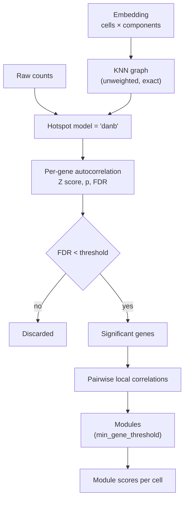

# Gene Programs & Hotspot

A global embedding gives you axes of variation. It does not tell you which genes
move together as a coordinated unit. That is what Hotspot provides, and it is
the step that turns an embedding into interpretable **gene programs**.

## Why run Hotspot on the embedding

Hotspot[^hotspot] tests whether a gene's expression is **autocorrelated on a
cell–cell similarity graph**: do cells that are neighbors in the graph have
similar expression of this gene, more than chance allows?

The graph is the whole point. PerturbScape builds it from the **contrastive
embedding**, not from raw expression or a standard PCA. So "neighboring cells"
means *cells that are similar in perturbation-specific structure*, and a gene
that scores as significantly autocorrelated is one that varies coherently along
that structure.

Run Hotspot on a plain PCA graph and you recover cell cycle and metabolic
programs. Run it on a contrastive graph and you recover programs organized by
what the perturbation actually did.

## The procedure

Each embedding module writes its projection to an `obsm` key — for example
`pca_projection` — and Hotspot uses that as `latent_obsm_key`.

## Parameters

Set in the master `config.yaml` and shared by every module:

| Key | Default | Meaning |
|---|---|---|
| `run_hotspot` | `true` | Whether to run Hotspot at all |
| `hotspot_n_neighbors` | `20` | Neighbors in the KNN graph |
| `hotspot_fdr_threshold` | `0.05` | FDR cutoff for gene significance and module creation |
| `hotspot_min_gene_threshold` | `30` | Minimum genes for a cluster to be kept as a module |

Fixed in the implementation and not exposed through config:

| Setting | Value | Note |
|---|---|---|
| `model` | `'danb'` | Depth-adjusted negative binomial — the count-appropriate null |
| `weighted_graph` | `False` | Edges are unweighted |
| `approx_neighbors` | `False` | Exact KNN; slower but deterministic |

!!! note "The `n_neighbors` default differs between layers"
    The `run_hotspot.py` argument parser defaults to `30`, but the master
    `config.yaml` passes `20`, and the config wins. The effective default for a
    normal pipeline run is **20**.

### Tuning guidance

`hotspot_n_neighbors` controls the scale of structure you detect. Smaller values
find finer, more local programs and more of them; larger values find broader,
smoother programs. With few cells per perturbation, a large neighborhood can
span the entire population and wash out the signal.

`hotspot_min_gene_threshold` is the main lever on module count. At the default
of 30, small but real programs are discarded. Lowering it to 10–15 recovers
them at the cost of more noise modules.

## Outputs

For a module `<m>`, in `results/<target>/`:

| File | Contents |
|---|---|
| `hotspot_<m>_results.csv` | Per-gene autocorrelation: `Z`, `Pval`, `FDR`, `C` |
| `hotspot_<m>_local_correlations.csv` | Gene × gene local correlation among significant genes |
| `hotspot_<m>_modules.csv` | Gene → module assignment; `-1` means unassigned |
| `hotspot_<m>_module_scores.csv` | Cell × module summary scores |
| `hotspot_<m>_metadata.txt` | Parameters and counts for the run |

!!! warning "`local_correlations` is quadratic in significant genes"
    It is a dense gene × gene matrix over every gene passing the FDR cutoff. At
    5,000 significant genes that is 25M cells — hundreds of megabytes per
    perturbation as CSV. Across a genome-scale screen this is usually the
    largest thing the pipeline produces. Plan storage accordingly, and consider
    a stricter `hotspot_fdr_threshold` if it becomes a problem.

## Module `-1`

In `hotspot_<m>_modules.csv`, genes that passed the FDR cutoff but did not join
a cluster meeting `min_gene_threshold` are labeled `-1`. This is normal and
often the largest group. Exclude it before any downstream analysis — it is
"unassigned", not "module number −1".

## Which modules produce gene programs

Seven of the eight modules run Hotspot. [`de-dgca`](../modules/de-dgca.md) does
not, because it produces no embedding to build a graph from — it contributes
gene programs through a different route (differential expression and
differential co-expression).

[^hotspot]:
    DeTomaso, D. & Yosef, N. Hotspot identifies informative gene modules across
    modalities of single-cell genomics. *Cell Systems* **12**, 446–456 (2021).
