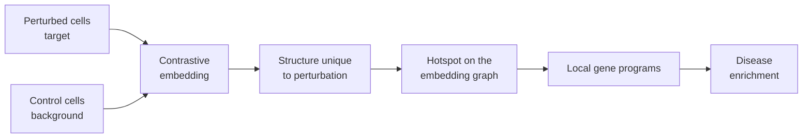

# Methods

PerturbScape rests on a single premise: **the interesting structure in a
Perturb-seq experiment is the variation present in perturbed cells but absent
from controls.** Standard dimensionality reduction cannot isolate that - it finds
whatever varies most, which is usually cell cycle, library size, or donor effects
shared by both groups.

Everything follows from that premise.

## Stage 1: from cells to gene programs

### Global embeddings - what changed overall

A contrastive method takes two covariance structures, one from target cells and
one from background cells, and finds directions that maximize target variance
*relative to* background variance. See
[Contrastive Embeddings](embeddings.md).

PerturbScape runs several of these because they disagree in useful ways, plus
`pca` and `cnmf` as non-contrastive references.

### Local gene programs - which genes move together

A global embedding gives axes of variation, not which genes act as a coordinated
unit. Hotspot fills that gap: it builds a nearest-neighbour graph in the
embedding space, finds genes with significant autocorrelation on that graph, and
clusters them into modules. See
[Gene Programs and Hotspot](gene-programs.md).

Because Hotspot runs on the **contrastive** embedding, the modules it recovers
are programs varying within perturbation-specific structure - not programs that
would appear in any dataset.

### Canonical contrastiveness

Alongside the embedding track, [`de-dgca`](../modules/de-dgca.md) computes the
two classical perturbed-versus-control comparisons:

- **Differential expression** - which genes change in mean abundance
- **Differential gene co-expression** - which gene *pairs* change in correlation

DGCA catches something DE cannot. A perturbation can leave every gene's mean
untouched while decoupling a regulatory relationship entirely. That shows up as a
differential correlation and is invisible to DE.

## Stage 2: from gene programs to disease

Programs alone do not say whether a perturbation matters for a disease.
[Disease Enrichment](disease-enrichment.md) answers that in four steps: select
programs carrying genetic signal for a trait, combine them into a per-perturbation
meta-program, convert the top meta-program genes into SNP annotations through
variant-to-gene links, and estimate a standardized heritability effect size with
stratified LD score regression.

## Two levels of contrast

The pipeline contrasts at two granularities, controlled by
[`mode`](../configuration.md#analysis-modes):

| Mode | Contrast | Answers |
|---|---|---|
| `singular` | Each perturbation vs background, independently | What does *this* perturbation do? |
| `pooled` | All perturbations combined vs background | What do perturbations do *in general* here? |

Disease enrichment is run per perturbation, so `singular` mode is what produces
the published perturbation-trait results. Pooled runs appear in the
[Data Portal](../../data/index.md) under the perturbation name `All`.
