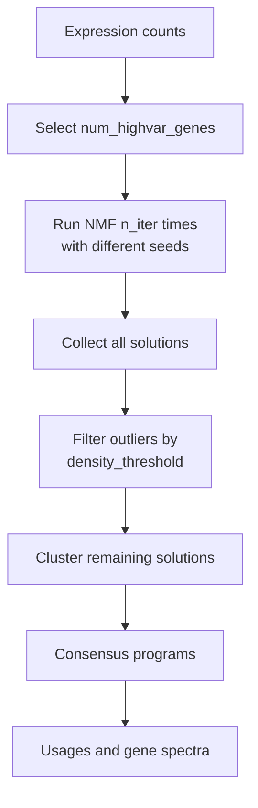

# Non-Contrastive Baselines

<span class="ps-pill">pca</span> <span class="ps-pill">cnmf</span>

Two modules that decompose the target population **without reference to
controls**. They are not contrastive, and that is the point: they show what you
would find without the contrastive machinery.

A program recovered by both `pca` and `cpca` is probably not specific to the
perturbation. A program unique to `cpca` probably is. Both modules still feed
[disease enrichment](../methods/disease-enrichment.md), where program selection
decides what actually carries genetic signal.

---

## pca

<span class="ps-pill ps-pill--muted">deterministic</span>

Standard PCA on the target cells.

### When to use it

**As a baseline.** Gene programs from `pca` are the ones found without any
contrast: cell cycle, library size, metabolic state.

**As a smoke test.** It is the fastest and lightest module and exercises the same
job hierarchy, Hotspot step, and output layout as everything else. Run it first
to validate a new configuration.

### Parameters

```yaml
# pca/config.yaml
n_components: 10
```

| Parameter | Type | Default | Description |
|---|---|---|---|
| `n_components` | int | `10` | Number of principal components |

The lightest module by a wide margin - 32 GB is usually ample where other modules
want 128 GB.

### Outputs

| File | Shape | Contents |
|---|---|---|
| `pca_projection.csv` | cells x components | Cell coordinates; the Hotspot latent space |
| `pca_loadings.csv` | genes x components | Gene contributions to each PC |
| `pca_variance_ratio.csv` | components | Fraction of variance per PC |
| `pca_metadata.txt` | | Run parameters |
| `hotspot_pca_*` | | See [Hotspot](hotspot.md) |

`pca_variance_ratio.csv` has no analogue in the contrastive modules, which report
eigenvalues instead. It is the quickest way to judge whether `n_components` is
set sensibly: if the last few PCs carry negligible variance, you have enough.

Note that unlike the contrastive modules, `pca` produces exactly `n_components`
columns rather than `4 x n_components` - there is no alpha to sweep.

---

## cnmf

<span class="ps-pill ps-pill--muted">stochastic</span>

Consensus non-negative matrix factorization.[^cnmf] Decomposes expression into
non-negative gene programs and their per-cell usages, aggregating many random
restarts into a stable consensus.

### Why NMF alongside the contrastive methods

NMF's non-negativity constraint yields **parts-based** decompositions: programs
add up to expression rather than cancelling against each other. Every gene has a
non-negative weight in every program, which makes programs directly readable as
gene sets - no sign convention to interpret, no orthogonality forcing spurious
structure.

### How consensus works



Individual NMF runs land in different local optima. Consensus NMF runs the
factorization `n_iter` times, discards solutions in low-density regions, and
averages what remains - so the reported programs are the ones that recur, not the
ones a single lucky seed found.

### Parameters

```yaml
# cnmf/config.yaml
k_mode: "single"
k_range: [5, 15]
k_single: 10
n_iter: 100
density_threshold: 0.1
num_highvar_genes: 2000

resources:
  threads: 16
```

| Parameter | Type | Default | Description |
|---|---|---|---|
| `k_mode` | str | `"single"` | `"single"` uses `k_single`; `"range"` tests `k_range` |
| `k_single` | int | `10` | Number of programs when `k_mode: "single"` |
| `k_range` | list | `[5, 15]` | Inclusive K range when `k_mode: "range"` |
| `n_iter` | int | `100` | NMF restarts per K |
| `density_threshold` | float | `0.1` | Local density cutoff for discarding outlier solutions |
| `num_highvar_genes` | int | `2000` | High-variance genes used in the prepare step |
| `resources.threads` | int | `16` | Parallel workers for factorization |

!!! warning "`k_mode: \"range\"` multiplies your runtime"
    Cost scales as `n_iter` times the number of K values. The default range
    `[5, 15]` is 11 values times 100 iterations = 1,100 factorizations **per
    perturbation**. In `singular` mode across a large screen this is rarely
    affordable.

    Use `k_mode: "range"` on a handful of representative perturbations to pick K,
    then switch to `"single"` for the full run.

!!! note "`threads` merges into the master `resources` block"
    `cnmf/config.yaml` sets only `resources.threads`. Because
    [dict merging is shallow](../configuration.md#the-nested-dict-subtlety),
    `mem_mb`, `partition`, and `time` are inherited from the master config rather
    than being lost.

### Outputs

| File | Shape | Contents |
|---|---|---|
| `cnmf_usages.csv` | cells x K | Per-cell program usage; the Hotspot latent space |
| `cnmf_gene_spectra_scores.csv` | K x genes | Z-scored gene loadings per program |
| `cnmf_gene_spectra_tpm.csv` | K x genes | Gene spectra in TPM units; the Hotspot input |
| `cnmf_spectra.txt` | K x genes | Raw consensus spectra |
| `cnmf_metadata.txt` | | Run parameters and the K used |
| `hotspot_cnmf_*` | | See [Hotspot](hotspot.md) |

### Which spectra file to use

`gene_spectra_scores` is Z-scored and appropriate for **ranking genes within a
program**. `gene_spectra_tpm` is in expression units and appropriate for
**comparing a gene across programs**, and is what Hotspot consumes. Using the
Z-scored version for cross-program comparison is a common mistake.

### Reproducibility

cNMF is stochastic. The consensus step makes results far more stable than a
single NMF run, but not bit-identical between runs. Programs supported by many
restarts are reproducible; marginal programs near `density_threshold` may appear
or vanish.

[^cnmf]:
    Kotliar, D. *et al.* Identifying gene expression programs of cell-type
    identity and cellular activity with single-cell RNA-Seq. *eLife* **8**,
    e43803 (2019).
