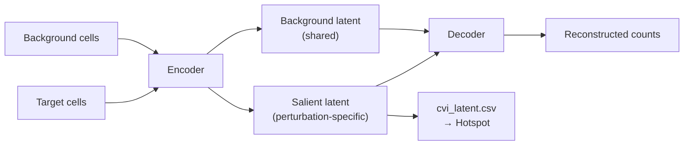

# `contrastivevi` — Contrastive Variational Inference

<span class="ps-pill">contrastive</span> <span class="ps-pill">deep model</span> <span class="ps-pill">stochastic</span>

A deep generative model[^cvi] that learns **two separate latent spaces**: a
*salient* space capturing variation unique to perturbed cells, and a *background*
space capturing variation shared with controls.

## What makes it different

The linear contrastive methods separate perturbation-specific from shared
variation by construction — subtract or whiten by the background covariance.
ContrastiveVI instead *learns* the separation, training an encoder that routes
shared variation into the background latent and everything else into the salient
latent.

That buys nonlinearity and an explicit generative model of counts. It costs
determinism, interpretability of individual dimensions, and training time.



Only the **salient** representation is exported and passed to Hotspot — the
background latent exists to absorb shared variation so it stays out of the
salient space.

## Parameters

```yaml
# contrastivevi/config.yaml
n_salient_latent: 10
n_background_latent: 10
max_epochs: 500
early_stopping: true
```

| Parameter | Type | Default | Description |
|---|---|---|---|
| `n_salient_latent` | int | `10` | Salient latent dimensions — the exported embedding |
| `n_background_latent` | int | `10` | Background latent dimensions |
| `max_epochs` | int | `500` | Maximum training epochs |
| `early_stopping` | bool | `true` | Stop when validation loss plateaus |

!!! tip "`n_background_latent` is the parameter people forget"
    If it is too small, shared variation has nowhere to go and leaks into the
    salient space — you get contamination that looks like perturbation signal.
    If it is far too large, the model may route genuine perturbation effects
    into the background and the salient space goes empty.

    Symptom of the second failure: the salient latent shows almost no structure
    and Hotspot finds very few significant genes. Try reducing
    `n_background_latent`.

!!! note "`early_stopping` means `max_epochs` is a ceiling"
    With the default `true`, training usually stops well before 500 epochs.
    Check `cvi_metadata.txt` for the epoch actually reached. If it equals
    `max_epochs`, the model had not converged and the limit should be raised.

## GPU

This is the one module that meaningfully benefits from a GPU:

```yaml
# contrastivevi/config.yaml
resources:
  partition: "gpu"
  mem_mb: 64000
  time: "12:00:00"
```

Your cluster may also require a GRES specification in `contrastivevi/profile/`
— check the existing profile rather than assuming `partition` alone suffices.

## Rules

| Rule | Produces |
|---|---|
| `contrastivevi_model` | Salient latent representation, gene list |
| `contrastivevi_hotspot` | Gene programs on the salient latent |

## Outputs

In `results/<target>/`:

| File | Shape | Contents |
|---|---|---|
| `cvi_latent.csv` | cells × `n_salient_latent` | Salient representation, columns `salient_1 … salient_n`; the Hotspot latent space |
| `cvi_genes.csv` | genes | Genes retained by the model |
| `cvi_metadata.txt` | — | Parameters, epochs trained, convergence |
| `hotspot_cvi_*` | — | See [Hotspot](hotspot.md) |

Note the file prefix is `cvi_`, not `contrastivevi_`.

Only target cells are represented in `cvi_latent.csv` — the salient
representation is requested for target cells specifically, so `project_which`
has no analogue here.

## Reproducibility

Neural training is stochastic and this module does not expose a seed in its
config. Results vary between runs. Treat gene programs that reproduce across
runs as real and single-run programs as provisional.

[^cvi]:
    Weinberger, E., Lin, C. & Lee, S.-I. Isolating salient variations of
    interest in single-cell data with contrastiveVI. *Nature Methods* **20**,
    1336–1345 (2023).
