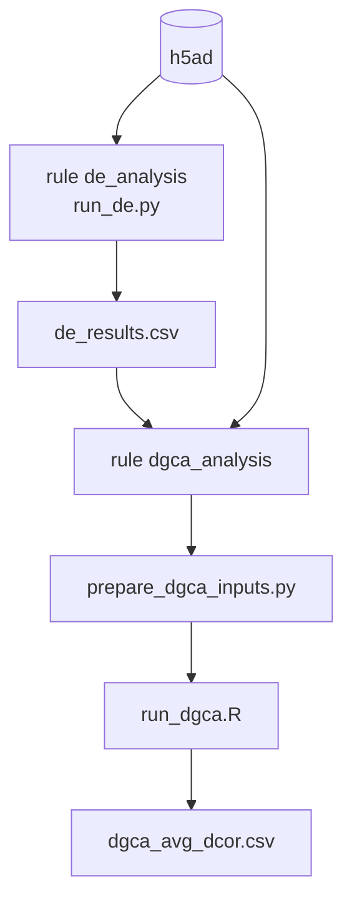

# `de-dgca` — Differential Expression & Differential Gene Correlation

<span class="ps-pill">contrastive</span> <span class="ps-pill">no embedding</span> <span class="ps-pill">no hotspot</span>

The canonical perturbed-vs-control comparisons. This module produces **no
embedding** and therefore **does not run Hotspot** — it is the only module whose
structure differs from the other seven.

## The two analyses

### Differential expression

Which genes change in mean abundance between perturbed and control cells. The
standard first question, and the standard limitation: it sees only shifts in
mean.

### Differential gene correlation

Which gene *pairs* change in correlation between the two conditions.

This is what DE cannot see. A perturbation can leave every gene's mean
expression untouched while decoupling a regulatory relationship entirely — two
genes tightly correlated in controls and independent after perturbation. The
means are unchanged; the regulatory structure is not. DGCA detects exactly this.



DGCA depends on the DE results, so the two rules run in sequence rather than in
parallel. The DGCA step is implemented in **R** (`run_dgca.R`); its dependencies
come from the module's `environment.yaml`.

## Parameters

```yaml
# de-dgca/config.yaml
de_pval_threshold: 0.05

dgca_cor_method: "pearson"
dgca_alpha: 0.05
dgca_min_genes: 10
dgca_use_de_genes_only: false
dgca_avg_method: "median"
dgca_n_perm: 100
dgca_filter_central: 0.01
dgca_filter_dispersion: 0.01
```

### DE

| Parameter | Type | Default | Description |
|---|---|---|---|
| `de_pval_threshold` | float | `0.05` | Significance cutoff for differential expression |

### DGCA

| Parameter | Type | Default | Description |
|---|---|---|---|
| `dgca_cor_method` | str | `"pearson"` | Correlation method |
| `dgca_alpha` | float | `0.05` | Significance cutoff for differential correlation |
| `dgca_min_genes` | int | `10` | Minimum genes required to run |
| `dgca_use_de_genes_only` | bool | `false` | Restrict to DE genes before correlating |
| `dgca_avg_method` | str | `"median"` | Aggregation for average differential correlation |
| `dgca_n_perm` | int | `100` | Permutations for the null distribution |
| `dgca_filter_central` | float | `0.01` | Filter on central tendency |
| `dgca_filter_dispersion` | float | `0.01` | Filter on dispersion |

!!! warning "`dgca_n_perm` and `dgca_use_de_genes_only` drive the cost"
    Differential correlation is computed over gene **pairs**, so cost is
    quadratic in genes and linear in `dgca_n_perm`. The default of 100
    permutations bounds achievable p-values at roughly 0.01 — fine for ranking,
    too coarse for stringent significance claims. Raising it to 1,000 improves
    resolution at ten times the cost.

    Setting `dgca_use_de_genes_only: true` restricts the pair space to DE genes
    and is by far the most effective way to make this module tractable on a
    large screen.

## Rules

| Rule | Produces |
|---|---|
| `de_analysis` | Differential expression results |
| `dgca_analysis` | Average differential correlation |

Neither is a Hotspot rule — `run_hotspot` has no effect on this module.

## Outputs

In `results/<target>/`:

| File | Contents |
|---|---|
| `de_results.csv` | Per-gene differential expression statistics |
| `de_metadata.txt` | DE run parameters |
| `dgca_avg_dcor.csv` | Per-gene average differential correlation |
| `dgca_metadata.txt` | DGCA run parameters |

!!! note "The full pairwise DGCA matrix is not retained"
    Differential correlation is computed over gene **pairs**, so a complete
    pairwise result is quadratic in genes and was producing very large files.
    Nothing downstream of program creation consumes it, so only the per-gene
    average differential correlation, `dgca_avg_dcor.csv`, is written.

## Mode behavior

Unlike the embedding modules, `de-dgca` passes the full target list through to
its scripts in `pooled` mode via a `--targets` argument, so the pooled
comparison is explicit about which perturbations were combined.
