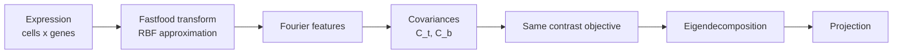

# Kernel Contrastive Modules

<span class="ps-pill">kcpca</span> <span class="ps-pill">kcontrapc</span>

The [linear contrastive objectives](linear-contrastive.md) applied in a **random
Fourier feature** space, capturing nonlinear structure that the linear forms
cannot represent.



The mapping uses **Fastfood**
(`sklearn_extra.kernel_approximation.Fastfood`), which approximates an RBF kernel
in \(O(n \log d)\) rather than forming an \(n \times n\) kernel matrix - the only
tractable option at single-cell scale.

Both modules search **20** alpha values instead of 40, since each evaluation is
more expensive.

## Shared kernel parameters

```yaml
sigma_list_target: null
sigma_list_background: null
kernel_seed: 42
use_fourier_basis: false
```

| Parameter | Type | Default | Description |
|---|---|---|---|
| `sigma_list_target` | list or null | `null` | RBF bandwidth for target cells; `null` uses \(\sqrt{N}\) |
| `sigma_list_background` | list or null | `null` | RBF bandwidth for background; `null` uses \(\sqrt{N}\) |
| `kernel_seed` | int | `42` | Seed for the Fastfood random projection |
| `use_fourier_basis` | bool | `false` | Run Hotspot in Fourier space rather than gene space |

!!! danger "`use_fourier_basis: true` produces uninterpretable modules"
    With `false` (the default), Hotspot runs on **genes** and modules are
    interpretable gene sets that can be handed to enrichment analysis and to
    [disease enrichment](../methods/disease-enrichment.md).

    With `true`, Hotspot runs on **Fourier features** - random projection
    coordinates with no gene identity. The modules are mathematically valid but
    cannot be interpreted biologically or scored for heritability.

    Keep it `false` unless you specifically want the Fourier-space view.

### Reproducibility

Results are deterministic **given a fixed `kernel_seed`**. Changing the seed
changes the random projection and therefore the embedding. To check that a
finding is not an artefact of one draw, rerun with a different seed and confirm
the gene programs are stable.

### Cost

The heaviest modules in the pipeline. The Fourier feature expansion dominates
memory. Suggested `mem_mb: 256000`, and a `bigmem` partition if available.

---

## kcpca

The subtractive objective in Fourier space:

\[
\Sigma(\alpha) = C_t - \alpha\, C_b
\]

with \(\alpha \in \{0\} \cup \mathrm{logspace}(-1,\ A,\ 20)\), where \(A\) is
`max_log_alpha`.

```yaml
# kcpca/config.yaml
sigma_list_target: null
sigma_list_background: null
kernel_seed: 42

use_de_genes: false
max_log_alpha: 3
transform_mode: "auto"
manual_alpha: null
n_components: 10
project_which: "target"
use_fourier_basis: false
```

### Outputs

| File | Contents |
|---|---|
| `kcpca_projection.csv` | Cell coordinates, columns `alpha_<a>_pc_<i>` |
| `kcpca_eigenvalues.csv` | Eigenvalues per alpha and component |
| `kcpca_eigenvectors.csv` | Loadings per alpha and component |
| `kcpca_best_alphas.txt` | The alpha values selected |
| `kcpca_metadata.txt` | Run parameters, including the seed |
| `hotspot_kcpca_*` | See [Hotspot](hotspot.md) |

---

## kcontrapc

The ratio objective in Fourier space. With
\(C_b + \gamma I = V \Lambda V^\top\) computed on the transformed features:

\[
\Sigma(\alpha) = V \Lambda^{-\alpha} V^\top C_t, \qquad \alpha \in [0, 1]
\]

Everything from [`contrapc`](linear-contrastive.md#contrapc) carries over - the
bounded alpha range, the forced inclusion of 0 and 1, and the role of gamma - but
applied to Fourier features rather than genes.

```yaml
# kcontrapc/config.yaml
sigma_list_target: null
sigma_list_background: null
kernel_seed: 42

use_de_genes: false
gamma: 0.001
transform_mode: "auto"
manual_alpha: null
n_components: 10
project_which: "target"
use_fourier_basis: false
```

!!! warning "gamma matters more here"
    Fourier features are dense and correlated, so the transformed background
    covariance is often worse conditioned than its gene-space counterpart. If
    high-alpha components look like noise, raise `gamma` - this is the first
    thing to try, not the last.

### Outputs

| File | Contents |
|---|---|
| `kcontrapc_projection.csv` | Cell coordinates, columns `alpha_<a>_pc_<i>` |
| `kcontrapc_eigenvalues.csv` | Eigenvalues per alpha and component |
| `kcontrapc_eigenvectors.csv` | Loadings per alpha and component |
| `kcontrapc_best_alphas.txt` | The alpha values selected, including `0.0` and `1.0` |
| `kcontrapc_metadata.txt` | Run parameters, including the seed |
| `hotspot_kcontrapc_*` | See [Hotspot](hotspot.md) |

!!! note "Eigenvectors live in the decomposition space"
    With `use_fourier_basis: false` the pipeline maps back to genes for Hotspot,
    but the `*_eigenvectors.csv` files reflect the space the decomposition was
    performed in. Check the metadata file to confirm which.

## See also

- [Linear Contrastive](linear-contrastive.md) - the linear forms of both objectives
- [Contrastive Embeddings](../methods/embeddings.md) - full mathematical treatment
