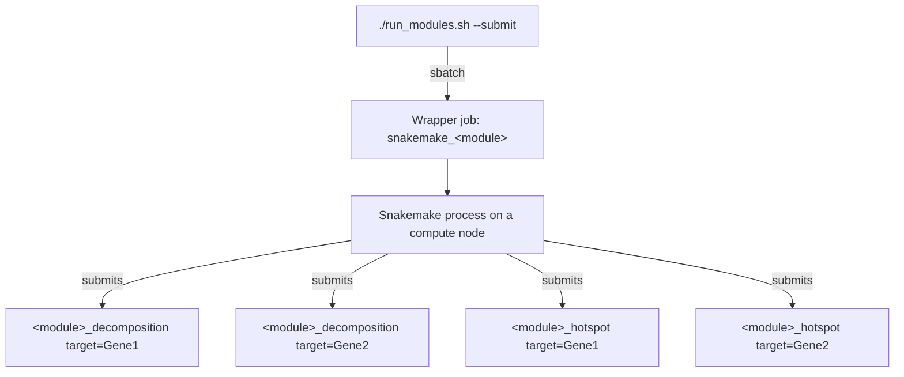

# Running the Pipeline

Every interaction goes through `run_modules.sh` at the repository root. It wraps
`sbatch`, activates conda on the compute node, and launches Snakemake with the
right executor.

## The job hierarchy



This two-tier structure explains most of the pipeline's operational behaviour:

- **Killing the wrapper stalls everything.** Snakemake is what submits and
  supervises jobs. If it dies, running jobs continue but nothing new is submitted
  and no outputs are finalized.
- **`squeue` shows both tiers.** Wrapper jobs are named `snakemake_<module>`;
  analysis jobs are named after the rule and target.
- **Wrapper wall time must exceed total pipeline time**, not per-job time.

## Command reference

```
./run_modules.sh [ACTION] [MODULE SELECTION] [OPTIONS]
```

`.snakemake_env.sh` must exist in the repository root. If missing, the script
prints the required contents and exits.

### Actions

Choose exactly one.

`--build-conda`
:   Build the conda environments declared by each module's `environment.yaml`.
    Submitted as a SLURM job by default.

    ```bash
    ./run_modules.sh --build-conda --all
    ./run_modules.sh --build-conda --modules cnmf,cpca
    ./run_modules.sh --build-conda --all --interactive
    ```

`--submit`
:   Submit analysis jobs. The main action.

    ```bash
    ./run_modules.sh --submit --all
    ./run_modules.sh --submit --modules pca,cpca
    ./run_modules.sh --submit --all --dry-run
    ./run_modules.sh --submit --modules cpca --forcerun cpca_decomposition
    ```

`--unlock`
:   Release a stale Snakemake working-directory lock, left behind when a run is
    killed rather than exiting cleanly.

    ```bash
    ./run_modules.sh --unlock --all
    ```

`--clear-logs`
:   Delete the log directories for the selected modules and exit.

    ```bash
    ./run_modules.sh --clear-logs --modules cpca
    ```

    !!! warning "This deletes your record of what happened"
        Logs are the only account of why a job failed. Clear them when starting
        a genuinely fresh run, not while debugging one.

### Module selection

Required for every action.

| Flag | Description |
|---|---|
| `-m`, `--modules` | Comma-separated list, e.g. `pca,cpca,cnmf`. No spaces. |
| `-a`, `--all` | Every available module |

Available modules: `pca`, `cpca`, `contrapc`, `kcpca`, `kcontrapc`, `cnmf`,
`contrastivevi`, `de-dgca`.

### Resource options

Apply to `--build-conda` and `--submit`, and size the **wrapper** job only. See
[Resources and SLURM](configuration.md#resources-and-slurm).

| Flag | Default (build) | Default (submit) | Description |
|---|---|---|---|
| `-p`, `--partition` | `cpu` | `cpu` | SLURM partition |
| `-t`, `--time` | `01:00:00` | `08:00:00` | Wall time |
| `--mem` | `8` | `64` | Memory in **GB** |

!!! note "`--mem` is in gigabytes"
    Unlike `mem_mb` in the YAML configs, which is in megabytes.

### Other options

`--interactive`
:   Build conda environments in the current shell rather than submitting a job.
    `--build-conda` only.

`-d`, `--dry-run`
:   Passes Snakemake's `-n`. Parses every `Snakefile`, reads the `.h5ad`,
    resolves targets, and prints the job plan without submitting.

    **Always dry-run before a large submission.** It costs seconds and catches
    config errors, missing files, and unexpected target counts.

`-f`, `--forcerun RULE`
:   Force a specific rule to rerun even if its outputs exist.

    Rule names follow `<module>_decomposition` and `<module>_hotspot`, with
    exceptions: `cnmf` uses `cnmf_factorization`, `contrastivevi` uses
    `contrastivevi_model`, and `de-dgca` uses `de_analysis` and `dgca_analysis`.

    !!! tip "Forcing a rule reruns everything downstream"
        Forcing `cpca_decomposition` also reruns `cpca_hotspot`, since Hotspot
        consumes the projection. To rerun only Hotspot - after changing
        `hotspot_n_neighbors`, say - force `cpca_hotspot` instead.

### Examples

=== "First run"

    ```bash
    ./run_modules.sh --build-conda --all --mem 16
    ./run_modules.sh --submit --modules pca --dry-run
    ./run_modules.sh --submit --modules pca
    ```

=== "Full submission"

    ```bash
    ./run_modules.sh --submit --all --mem 64 --time 24:00:00
    ```

=== "Recover from a kill"

    ```bash
    ./run_modules.sh --unlock --all
    ./run_modules.sh --submit --all
    ```

=== "Retune Hotspot only"

    ```bash
    ./run_modules.sh --submit --modules cpca --forcerun cpca_hotspot
    ```

=== "Big-memory kernel modules"

    ```bash
    ./run_modules.sh --submit --modules kcpca,kcontrapc \
      --partition bigmem --time 24:00:00
    ```

---

## Monitoring

### Job status

```bash
# Everything you have queued or running
squeue -u $USER

# Just the Snakemake supervisors
squeue -u $USER | grep snakemake_

# Completed jobs with exit state and runtime
sacct -u $USER --format=JobID,JobName%40,State,Elapsed,MaxRSS,ReqMem
```

`MaxRSS` against `ReqMem` is the fastest way to right-size `resources.mem_mb`
after a first run - including for jobs that succeeded but came close.

### Log layout

```
<module>/logs/
├── wrapper/          Snakemake supervisor: pipeline-level progress
│   ├── snakemake_*.out
│   ├── snakemake_*.err
│   └── conda_build_*.err
├── <method>/         Per-target application logs
│   └── <target>.log
└── slurm/            Raw SLURM stdout/stderr per job
    └── *.out
```

| Question | Log |
|---|---|
| How many targets were resolved? Is it progressing? | `logs/wrapper/snakemake_*.out` |
| Why did *this perturbation* fail? | `logs/<method>/<target>.log` |
| Was the job OOM-killed or did it time out? | `logs/slurm/*.out` and `sacct` |
| Why did an environment build fail? | `logs/wrapper/conda_build_*.err` |

The distinction matters: a Python traceback appears in the method log, but an OOM
kill leaves no traceback at all - the process is terminated by the kernel, and
only SLURM records it.

### Reading the wrapper log

At startup each `Snakefile` prints its resolved configuration:

```
Skipping 12 perturbations with < 50 cells:
  - GENE_A: 31 cells
  - GENE_B: 44 cells
Singular mode: 488 perturbations to analyze (min_cells=50)

Analysis configuration:
  Mode: singular
  Background: non-targeting
  Targets: 488
```

Check this first on every run. It confirms your config took effect and tells you
exactly which perturbations were excluded and why - information available nowhere
else.

### Progress by output

```bash
# Completed decompositions
ls cpca/results/*/cpca_projection.csv 2>/dev/null | wc -l

# Which targets have not finished
comm -13 \
  <(ls cpca/results/*/hotspot_cpca_modules.csv 2>/dev/null | cut -d/ -f3 | sort) \
  <(ls -d cpca/results/*/ | cut -d/ -f3 | sort)
```

### Finding failures

```bash
sacct -u $USER --state=FAILED,OUT_OF_MEMORY,TIMEOUT \
  --format=JobID,JobName%40,State,Elapsed,MaxRSS

grep -l "Traceback\|Error" cpca/logs/cpca/*.log
```

`OUT_OF_MEMORY` and `TIMEOUT` are distinct from `FAILED` in SLURM and are
frequently the real story - a job that "failed" with no traceback was almost
certainly one of these.

### Cancelling

```bash
scancel <job_id>        # one job
scancel -u $USER        # everything
```

!!! warning "Cancelling the wrapper leaves a lock behind"
    Snakemake locks its working directory and releases the lock on clean exit. A
    cancelled wrapper cannot release it, so the next submission fails with
    `Directory cannot be locked`. Run `./run_modules.sh --unlock --modules
    <module>` before resubmitting.

---

## Troubleshooting

??? failure "`Not enough cells in target or background! Make sure both > 25!`"
    Raised inside the contrastive fit, after the job has started. `min_cells` did
    not filter this target because it was set below 25.

    ```yaml
    min_cells: 50    # never below 25 in singular mode
    ```

    The most common source of wasted cluster time on a first run.

??? failure "`Directory cannot be locked`"
    A previous run was killed without releasing Snakemake's lock.

    ```bash
    ./run_modules.sh --unlock --modules <module>
    ./run_modules.sh --submit --modules <module>
    ```

    Before unlocking, confirm nothing is still running with
    `squeue -u $USER | grep snakemake_`. Unlocking a live run causes two
    Snakemake processes to write the same outputs.

??? failure "Job fails with no traceback in the method log"
    Almost always an OOM kill or a timeout - the kernel terminates the process
    before Python can report anything.

    ```bash
    sacct -j <job_id> --format=JobID,State,Elapsed,MaxRSS,ReqMem
    ```

    `OUT_OF_MEMORY` means raise `resources.mem_mb`. `TIMEOUT` means raise
    `resources.time`. Both live in the module's `config.yaml`, not in the
    `run_modules.sh` flags.

??? failure "Out of memory"
    Raise the analysis job's memory, not the wrapper's:

    ```yaml
    resources:
      mem_mb: 256000
    hotspot_resources:
      mem_mb: 128000
    ```

    If a job still cannot fit, reduce the problem: raise `min_cells`, set
    `use_de_genes: true` to restrict the gene space, or lower `n_components`.

??? failure "Conda environment build fails"
    ```bash
    cat <module>/logs/wrapper/conda_build_*.err
    ./run_modules.sh --build-conda --modules <module> --mem 16
    ```

    Solver failures usually need more memory or time. `cnmf` and
    `contrastivevi` have the heaviest dependency trees.

??? failure "Disk full / no space left on device"
    `temp_dir: "auto"` uses node-local `/tmp`, which is often small. Point it at
    scratch:

    ```yaml
    temp_dir: "/path/to/scratch"
    ```

    Also check the size of `hotspot_*_local_correlations.csv` - it is quadratic
    in the number of significant genes and is usually the largest output.

??? question "The wrapper finished but most results are missing"
    The wrapper hit its wall time and was killed, taking Snakemake with it.

    ```bash
    ./run_modules.sh --submit --all --time 48:00:00
    ```

    Snakemake resumes from existing outputs, so completed targets are not
    recomputed.

??? question "Nothing is being submitted and the wrapper is idle"
    The wrapper reads your entire `.h5ad` at parse time before submitting
    anything. For a large file this takes a while and looks like a hang. If the
    log has not printed the `Analysis configuration:` block yet, it is still
    loading. If it was OOM-killed during load, raise the wrapper's `--mem`.

??? question "A few perturbations failed. How do I retry only those?"
    Resubmit. Snakemake reruns anything with missing outputs and skips completed
    targets:

    ```bash
    ./run_modules.sh --submit --modules cpca
    ```

    If they fail again, the cause is specific to those perturbations - usually
    too few cells. Check `logs/<method>/<target>.log`.

??? question "Results changed between runs"
    Kernel modules use a random Fastfood projection seeded by `kernel_seed`
    (default `42`). [`contrastivevi`](modules/contrastivevi.md) trains a neural
    model. [`cnmf`](modules/baselines.md#cnmf) aggregates `n_iter` random
    restarts. The linear modules - `pca`, `cpca`, `contrapc` - are deterministic
    given the same input and config.

### Getting help

When opening an issue on
[the pipeline repository](https://github.com/Deylab999MSKCC/perturbscape/issues),
include the module and exact command, the `Analysis configuration:` block from
the wrapper log, the relevant `logs/<method>/<target>.log`, `sacct -j <job_id>
--format=JobID,State,Elapsed,MaxRSS,ReqMem`, and your master and module
`config.yaml`.
