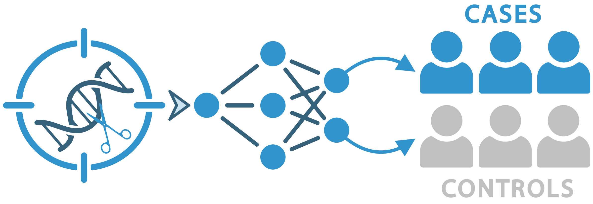

# PerturbScape { .ps-visually-hidden }

Perturbation to disease mapping

PerturbScape learns the <strong>gene programs</strong> that characterize distinct
perturbation processes in Perturb-seq data, then measures how much of a complex
disease's <strong>heritability</strong> those programs explain.

[Data Portal](data/index.md){ .md-button .md-button--primary }
[Documentation](docs/index.md){ .md-button }

7Datasets

10,223Perturbations

39Traits

39,142Scored pairs

A Perturb-seq screen tells you what each perturbation does to a cell. It does not
tell you whether that matters for disease. PerturbScape closes that gap in two
stages: a Snakemake pipeline of eight complementary methods discovers gene
programs, then a separate enrichment stage scores those programs against GWAS
heritability to produce a **Trait Relevance Score** for every perturbation-trait
pair.

Data Portal
### Explore the results
Interactive UMAPs of 39,142 perturbation-trait pairs, coloured by TRS. Click any
point for its meta-program genes and enriched pathways.
[Browse the data](data/index.md){ .ps-route-go }

Documentation
### Run the pipeline
Installation, configuration, and the eight program modules, followed by the full
disease-enrichment methodology with the code used at each step.
[Read the docs](docs/index.md){ .ps-route-go }

