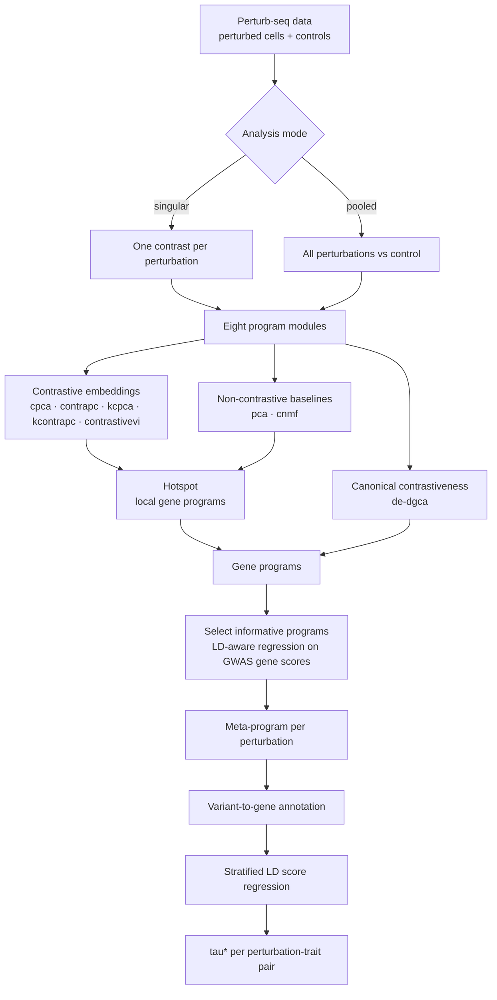

# PerturbScape { .ps-visually-hidden }

Perturbation to disease mapping

PerturbScape learns the <strong>gene programs</strong> that characterize distinct
perturbation processes in Perturb-seq data, then measures how much of a complex
disease's <strong>heritability</strong> those programs explain.

[Documentation](docs/index.md){ .md-button .md-button--primary }
[Data Portal](data/index.md){ .md-button }

7Datasets

10,222Perturbations

40Traits

38,954Perturbation-trait pairs

6.9MMeta-program gene ranks

## What it does

A Perturb-seq screen tells you what each perturbation does to a cell. It does not
tell you whether that matters for disease. PerturbScape closes that gap in two
stages.

**Program discovery** runs a Snakemake pipeline of eight complementary methods
over the raw data. Contrastive methods isolate variation present in perturbed
cells but absent from controls; Hotspot then converts each embedding into
coherent gene programs.

**Disease enrichment** takes those programs and asks which of them carry genetic
signal for a trait. Programs are scored against GWAS gene-level statistics,
combined into a per-perturbation meta-program, converted into SNP annotations
through variant-to-gene links, and evaluated with stratified LD score regression.

The result is a standardized effect size, tau\*, for every perturbation-trait
pair, together with the genes and pathways driving it.

Documentation
### Run the pipeline
Installation, configuration, and the eight program modules, followed by the full
disease-enrichment methodology with the code used at each step.
[Read the docs](docs/index.md){ .ps-route-go }

Data Portal
### Explore the results
Filter 38,954 perturbation-trait pairs by dataset, context, and trait. Open any
pair to see its top 100 meta-program genes and enriched pathways.
[Browse the data](data/index.md){ .ps-route-go }

## The two stages in more detail

STAGE 1 / A
### Contrastive embeddings
Four contrastive formulations plus a deep generative model isolate the variance
structure unique to perturbed cells, rather than the variance shared with
controls.

STAGE 1 / B
### Local gene programs
Hotspot builds a nearest-neighbour graph in each embedding and finds genes with
significant autocorrelation on it, clustering them into modules.

STAGE 1 / C
### Canonical contrastiveness
Differential expression and differential co-expression capture effects the
embeddings miss, including regulatory decoupling that leaves means unchanged.

STAGE 2 / A
### Informative program selection
Each program is regressed against GWAS gene-level Z-scores, whitened to account
for LD-induced correlation between neighbouring genes.

STAGE 2 / B
### Meta-program construction
Programs surviving selection are combined by leave-one-chromosome-out ridge
regression into a single gene ranking per perturbation and trait.

STAGE 2 / C
### Heritability enrichment
Top meta-program genes become SNP annotations through variant-to-gene links, and
S-LDSC returns a standardized tau\* with a jackknife standard error.

## Scope

PerturbScape is two connected but separately executed pieces. Program discovery
is a Snakemake workflow designed for a SLURM cluster and is fully contained in
the [pipeline repository](https://github.com/Deylab999MSKCC/perturbscape). Disease
enrichment runs outside Snakemake and depends on large external resources -
GWAS summary statistics, MAGMA gene results, LD reference panels, and
variant-to-gene maps - that are not distributed here. The
[Disease Enrichment](docs/methods/disease-enrichment.md) page documents that
stage step by step, with the code for each, so it can be reproduced against your
own copies of those resources.
